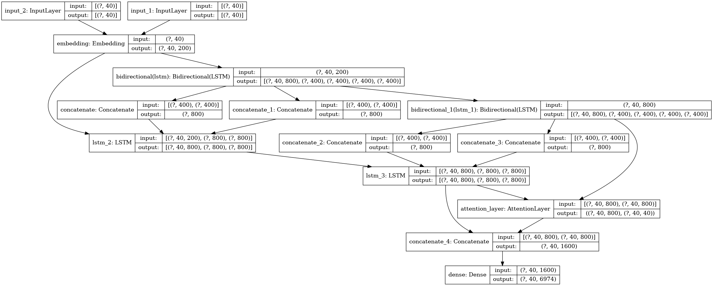

# Seq2Seq-chatbot-with-attention

## Introduction

This Chatbot is a TensorFlow implementation of Seq2Seq Mode. It make use of a attention based seq2seq model RNN.

Encoder architecture: Stacked Bidirection LSTM with 400 nodes

Decoder architecture: LSTM with 400*2 nodes
	
### Results :
| Train Accuracy | Test Accuracy |
|:---:|:---:|
| 83.72%  |  78.40%|

The overall architecture of the model using model.summary() :

